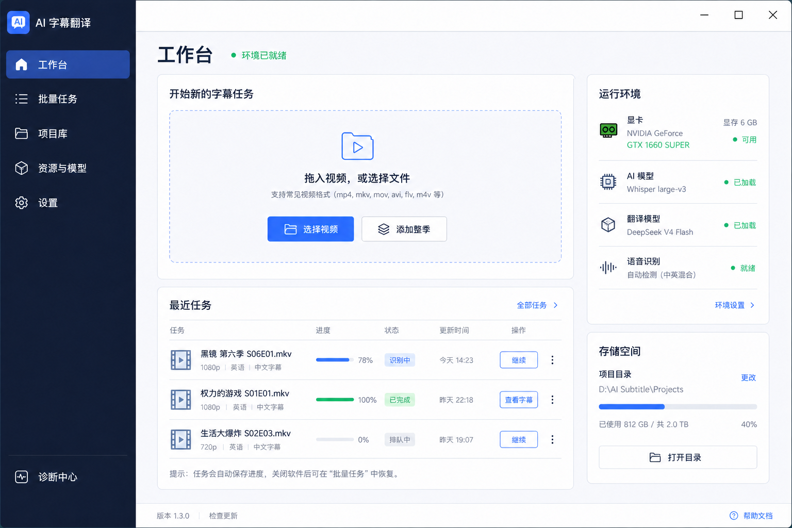
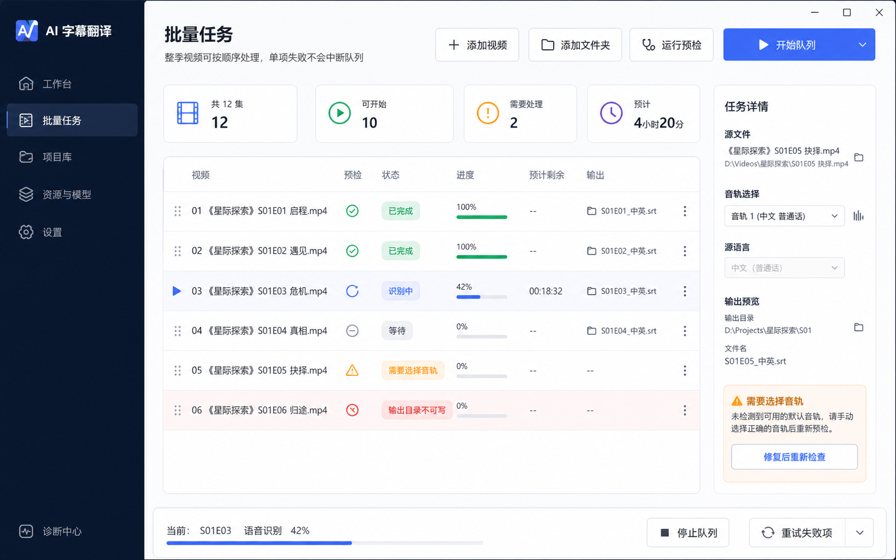
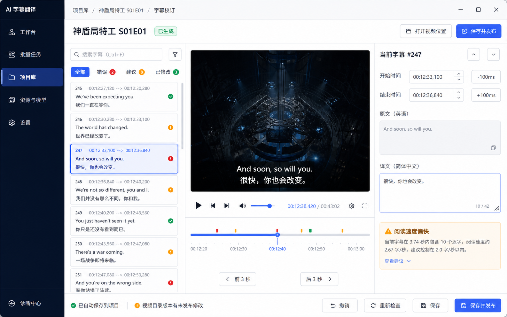

# AI 字幕翻译：整体 UI/UX 重设计方案

> 产品定位：面向不懂外语但希望得到可用中文字幕的普通影视用户，同时保留对模型、音轨和字幕时间轴有要求的进阶能力。  
> 设计目标：让用户始终知道“现在在哪里、任务进行到哪、下一步该做什么、失败后如何恢复”。

## 1. 现有体验诊断

现有 MVP 的后台能力已较完整，但界面仍以“把所有设置放进一个页面”为主要组织方式，产生以下问题：

- 首页同时承担文件导入、任务参数、依赖提示、发布设置、运行进度和完成操作，信息密度持续增长。
- 配置向导、主页、项目历史和批量队列是彼此独立的窗口，用户缺少稳定的全局位置感。
- 核心动作缺少层级：开始任务、配置依赖、校订字幕、重新发布在视觉上接近。
- 技术词直接暴露较多，普通用户需要理解 runtime、VAD、Provider、缓存键等实现概念。
- 状态主要依赖文本和进度条，缺少“等待—处理中—需要处理—完成”的统一状态语言。
- 项目详情、任务恢复、字幕校订之间需要关闭窗口再进入另一入口，工作流不连续。
- 空状态、首次使用、失败恢复和完成后的下一步没有形成一致的产品引导。

重设计不应只是改变颜色和圆角，而应先重建导航、任务模型和页面职责。

## 2. 产品信息架构

采用单主窗口、固定左侧导航和右侧内容区，减少多窗口跳转。

### 一级导航

1. **工作台**：新建任务、继续最近任务、查看运行概览。
2. **批量任务**：队列创建、预检、顺序调整、运行和汇总。
3. **项目库**：历史项目、筛选、恢复、校订、重新发布和空间管理。
4. **字幕校订**：作为项目内页面打开，同时保留面包屑返回项目。
5. **资源与模型**：Whisper 模型、VAD、runtime、FFmpeg、GPU 自检。
6. **设置**：翻译服务、默认字幕格式、发布命名、外观和数据保留。
7. **诊断中心**：固定在侧栏底部，有异常时显示提醒徽标。

### 页面职责原则

- 工作台只负责“开始什么”和“最近发生了什么”，不堆放完整高级设置。
- 新建任务使用右侧抽屉或三步轻向导：选择视频 → 确认字幕偏好 → 开始。
- 技术配置集中到“资源与模型”，任务页只显示“环境就绪”或可操作的缺项。
- 发布位置和命名作为“字幕交付”概念呈现，默认值折叠，高级模板按需展开。
- 项目、任务、字幕文件统一围绕同一个项目详情页串联。

## 3. 核心用户旅程

### 首次使用

启动 → 欢迎页说明本地识别与云端翻译 → 检测硬件 → 准备 FFmpeg/runtime/VAD/Whisper → 配置 DeepSeek → 运行一段自检 → 进入工作台。

向导顶部显示 1/5 进度和预计剩余时间；每一步只回答一个问题。GPU 不可用时提供 CPU 降级，不使用恐吓式错误。

### 单视频任务

拖入视频 → 卡片显示文件、时长和音轨 → 默认生成双语或中文 → 展开“高级选项”才显示源语言、QA/QC、模型覆盖 → 显示字幕最终文件名预览 → 开始。

运行页将阶段展示为纵向步骤：准备媒体、识别、翻译、质量检查、发布。每一步包含状态、耗时和简短说明；失败时只突出当前阶段，并给出“重试”“检查配置”“查看详情”。

### 批量任务

添加整季 → 自动预检 → 只要求处理异常项 → 确认统一策略 → 开始队列。列表用状态胶囊和每项进度表达，不用长错误挤占主表格；错误详情在右侧检查器展开。

### 完成与校订

完成页提供三个主动作：播放检查、校订字幕、打开字幕位置。校订页保存后明确显示“已保存到项目”和“已发布到视频目录”两个状态，避免副本认知混乱。

## 4. 页面设计

### 4.1 工作台

- 顶部：页面标题、环境状态、通知/诊断入口。
- 主卡：大面积拖放区，支持“选择单个视频”和“添加整季”。
- 最近任务：最多 5 项，展示封面占位、文件名、阶段、进度和继续按钮。
- 右侧概览：GPU、当前模型、DeepSeek、磁盘空间，用自然语言表达。
- 首次空状态强调唯一主操作，隐藏无关统计。

### 4.2 新建任务抽屉

- 文件摘要和音轨是第一屏内容。
- “字幕偏好”使用可视化选项卡：仅中文、原文+中文。
- “交付位置”默认显示“视频旁边”，下方实时预览文件名。
- 高级设置折叠：模型、语言、QA/QC、命名模板。
- 底部固定操作栏：费用提示、取消、开始生成。

### 4.3 批量任务中心

- 顶部工具栏：添加视频、添加文件夹、预检、开始。
- 左侧主体表格：视频、预检、状态、进度、预计时间、输出。
- 右侧详情检查器：当前项的音轨、语言、错误和覆盖设置。
- 底部队列汇总：总时长、已完成、失败、预计剩余，不与表格争夺空间。
- 已完成项可折叠，失败项可一键筛选。

### 4.4 项目库与项目详情

- 项目库采用列表/紧凑卡片切换，支持状态、日期、文件是否存在筛选。
- 点击项目在同一窗口进入详情，不弹出新窗口。
- 详情页顶部是项目名和状态，下面用标签页组织：概览、字幕、处理记录、文件与缓存。
- 常用动作固定：继续处理、校订字幕、重新发布；删除和清缓存放入“更多”菜单。

### 4.5 字幕校订中心

- 三栏结构：左侧字幕列表，中间视频预览，右侧当前字幕属性；无播放器时中间显示外部播放引导。
- 顶部时间轴和播放控制，底部固定保存状态。
- 问题筛选使用“全部、错误、建议、已修改”，避免在表格中显示冗长错误列。
- 时间输入支持键盘微调；保存、保存并发布区分清晰。

### 4.6 资源与模型

- 用组件卡片代替一次性向导页面：FFmpeg、识别引擎、VAD、Whisper 模型。
- 每张卡只显示状态、版本、占用和一个主操作。
- GPU 与推理自检独立成“运行能力”卡，显示推荐模型和预计速度。

### 4.7 设置与诊断

- 设置分组：翻译服务、字幕默认值、发布与命名、存储、外观。
- API Key 只显示已配置状态和末尾掩码，不提供明文读取。
- 诊断中心按“正常、建议处理、阻塞问题”分组，一键导出脱敏报告。

## 5. 视觉系统

### 色彩

- 背景：`#F6F7FB`，内容卡片：`#FFFFFF`。
- 主文字：`#182033`，次级文字：`#667085`。
- 品牌蓝：`#4F6BFF`，悬停：`#4058D9`。
- 成功：`#16A36A`，警告：`#F59E0B`，错误：`#D64545`。
- 深色侧栏：`#151D31`，用于建立稳定导航锚点。

### 排版与间距

- 中文优先使用 Segoe UI、Microsoft YaHei UI 系统字体栈。
- 页面标题 26–28 px，卡片标题 16–18 px，正文 13–14 px，辅助信息 12 px。
- 采用 4/8 px 基础间距体系；页面边距 28–32 px，卡片间距 16 px。
- 控件高度统一为 36/40 px，主按钮至少 96 px 宽。

### 组件语言

- 卡片圆角 10–12 px，边框优先于重阴影。
- 状态统一使用图标 + 文本胶囊，不能只靠颜色传达。
- 每页只保留一个高强调主按钮；危险操作不与主操作并列。
- 技术详情默认收起，错误首先显示用户能理解的结果和修复动作。

## 6. 交互与可访问性

- 所有长任务在离开页面后继续运行，侧栏和顶部持续显示全局任务状态。
- 关闭窗口、取消、清缓存、覆盖字幕明确区分影响范围。
- 键盘焦点顺序与视觉顺序一致；所有图标按钮有文字提示。
- 支持 100%–200% Windows 缩放，最小窗口不出现文字重叠。
- 列表提供空状态、加载状态、错误状态和无结果状态。
- 动画控制在 120–180 ms，进度变化不过度跳动。

## 7. 实施顺序

### 第一阶段：建立应用外壳

固定侧栏、页面导航、统一标题栏、主题资源、按钮/输入/状态组件；把现有窗口迁为页面，但不改后台能力。

### 第二阶段：重做工作台与任务详情

实现新建任务抽屉、最近任务、阶段时间线和完成动作，移除首页技术配置堆叠。

### 第三阶段：批量中心与项目库

实现预检视图、右侧详情检查器、项目详情标签页和统一恢复入口。

### 第四阶段：校订、资源与诊断

接入同步预览框架、问题筛选、组件管理卡和脱敏诊断中心。

### 第五阶段：视觉与可访问性验收

覆盖高 DPI、键盘、长路径、中文/英文混排、空状态、失败状态和小屏布局，形成 UI 回归截图基线。

## 7.1 实施记录

- 0.6.0：完成统一应用外壳、固定侧栏、全局视觉令牌和工作台首轮改造。
- 0.7.0：将批量任务与项目库迁入主窗口页面导航，保留队列控制、任务恢复、字幕校订、重新发布和项目文件管理能力。
- 下一步：按第二阶段目标重构工作台任务创建与处理详情，再完善批量预检和项目详情层级。

## 8. 产品验收指标

- 新用户不阅读文档即可在 5 分钟内完成首次配置并开始任务。
- 已配置用户从拖入视频到开始任务不超过 3 次主要操作。
- 任意失败状态在当前页面提供一个明确的推荐动作。
- 用户能在 10 秒内找到最近项目、字幕位置和重新发布入口。
- 1366×768、150% 缩放下无控件重叠和关键操作不可见。
- 普通模式不出现 runtime、缓存键、Provider 等非必要技术术语。

## 9. 高保真概念图

概念图用于确认信息架构、视觉层级与页面密度，不代表最终逐像素实现；开发时应使用真实数据、统一设计令牌和 WPF 原生组件复现。

### 工作台

### 批量任务中心

### 字幕校订中心

